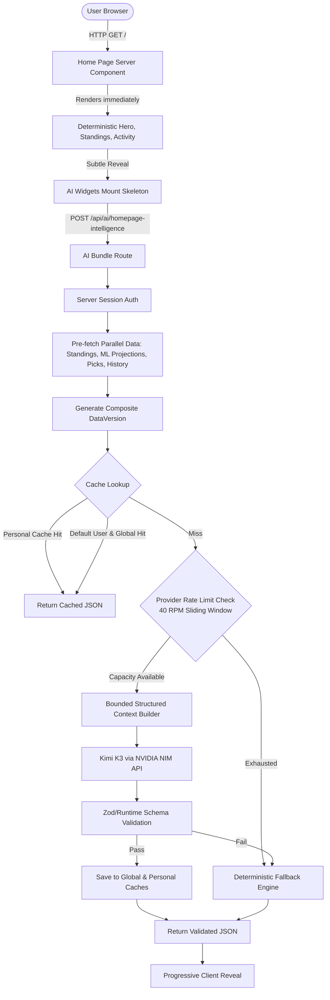

# F1 Hub Agentic AI Architecture & Implementation Guide

Comprehensive documentation of the Agentic AI layer for F1 Hub, powered by Moonshot AI's Kimi K3 via NVIDIA NIM.

---

## 1. Overview

F1 Hub is a high-performance Formula 1 intelligence and prediction platform. The Agentic AI layer transforms the homepage from a static dashboard into an adaptive, personalized F1 intelligence command center.

### Core Problem Solved
Traditional sports dashboards present raw tables and static statistics, placing the burden of interpretation entirely on the user. F1 Hub combines:
1. **Deterministic Application Layer**: Standings, points, gaps, historical track records, and head-to-head metrics.
2. **Machine Learning Layer**: Random Forest winner classifications and Monte Carlo finish order simulations.
3. **Agentic AI Layer (Kimi K3)**: Synthesizes complex multi-dimensional data into strategic briefings, narrative context, and coaching advice without ever taking over application control.

---

## 2. Architecture



---

## 3. Why Kimi K3

Moonshot AI's **Kimi K3** (`moonshotai/kimi-k3`) was selected as the foundational model via NVIDIA NIM:
- **Long-Context Reasoning**: Deep contextual synthesis across season trajectories, circuit quirks, and user prediction tendencies.
- **Strict Structured Output & Tool Calling**: Native adherence to JSON schema outputs and function definitions.
- **Configurable Reasoning Effort**: Supports fine-tuned `reasoning_effort` ("low", "medium", "high") balancing latency and depth.
- **Multimodal Evolution Path**: Future capabilities for analyzing telemetry charts, circuit layout overlays, and weather radar images.

---

## 4. Provider Abstraction

The AI architecture isolates provider logic behind strict TypeScript interfaces (`AIProvider`), decoupling application logic from NVIDIA or Moonshot specifics.

### Interface (`src/lib/ai/types.ts`)
```typescript
export interface AIProvider {
  readonly name: string;
  chat(
    messages: AIMessage[],
    tools: AIProviderToolDef[] | null,
    config: AIProviderConfig
  ): Promise<AIResponse>;
}
```

### Adding a New Provider
1. Implement the `AIProvider` interface in `src/lib/ai/<providerName>.ts`.
2. Register the provider using `registerProvider("<providerName>", providerInstance)`.
3. Set `AI_PROVIDER=<providerName>` in environment variables. No application routes or prompts need to change.

---

## 5. Homepage AI Flow

The homepage employs a single bundled request lifecycle:
1. **Immediate Page Mount**: Deterministic UI renders instantly; AI widgets show geometry-matched skeleton placeholders.
2. **Session Verification**: The endpoint verifies the HTTP-only session cookie server-side.
3. **Deterministic Pre-fetching**: Reads upcoming race, standings, track history, user pick, ML simulation, and recent posts in parallel.
4. **Data Versioning**: Computes a SHA-256 composite hash of all underlying data.
5. **Two-Tier Cache Check**: Evaluates personal cache (authenticated) or global cache (guest/default).
6. **Provider Capacity Guard**: Verifies outbound request count against the 40 RPM ceiling within a 60-second window.
7. **Single Invocational Call**: Pre-computed data is passed to Kimi K3 in one call (zero tool back-and-forth).
8. **Schema Validation**: Output is validated against `HomepageIntelligence`.
9. **Cache Commit**: Results are stored in L1 memory and `ai_cache` table.
10. **Client Reveal**: Framer Motion smoothly fades in validated content (`opacity: 0 -> 1`, `y: 8px -> 0`).

---

## 6. Agent Orchestration: Direct Mode vs Agent Mode

- **Direct Mode (Homepage)**: Deterministic data is pre-fetched by Next.js server code and injected directly into prompt context. Kimi K3 executes in a single shot without tool roundtrips. This delivers sub-second processing and predictable cost.
- **Agent Mode (Interactive Agents)**: Reusable bounded tool-calling loop (max 8 steps, max 12 tool calls) designed for interactive features (e.g., Ask F1, Race Strategy Analyst).

---

## 7. Tool Architecture

Tools in `src/lib/ai/tools/index.ts` serve as reusable infrastructure for agent mode:

| Tool | Scoped | Description | Security Invariant |
|---|---|---|---|
| `getUpcomingRace` | Public | Next GP details, circuit, schedule | Sanitized fields only |
| `getCurrentStandings` | Public | Driver & Constructor championship standings | Uses cached app compute |
| `getTrackHistory` | Public | Historical circuit performance & defending winners | Parameter type checked |
| `getDriverStats` | Public | Driver career statistics | Pure lookup |
| `getUserPrediction` | User | User's pick for a specific round | `ctx.userId` enforced from server session |
| `getSeasonSummary` | Public | Editorial season recap & round metrics | App-derived calculations |

---

## 8. Database Access Principles

> [!IMPORTANT]
> The AI model **never** receives direct database credentials, arbitrary SQL access, or raw table query capabilities.

All database reads are executed by strongly-typed application functions wrapped in service-layer queries (`queryWithRetry`) using `supabaseAdmin`.

---

## 9. Authentication Model

- `userId` is strictly derived from server-side decrypted `iron-session` cookies.
- Neither model arguments nor client request bodies can supply or override a `userId`.
- Unauthenticated requests receive `userId = null` and access global intelligence exclusively.

---

## 10. Authorization & Data Isolation

- **Cache Partitioning**: Personal cache keys (`ai:personal:{userId}:{raceId}:{dataVersion}`) include the verified `userId`. User A can never query or receive User B's cached insights.
- **Tool Level Isolation**: Tools marked `isUserScoped: true` reject calls when `ctx.userId` is absent and ignore any ID provided in LLM tool parameters.

---

## 11. Prompt Architecture & Versioning

Prompts are version-controlled string templates (`HOMEPAGE_INTELLIGENCE_PROMPT_V1`) located in `src/lib/ai/prompts/`.
- **System Instructions**: Define role, strict tone, and forbidden actions (no fabrication, no URL generation).
- **Tagged Context Blocks**: Structured data is passed inside `<STRUCTURED_F1_DATA>`, while community content is quarantined inside `<UNTRUSTED_COMMUNITY_DATA>`.

---

## 12. Prompt Injection Protection

Defense in depth against untrusted user and community content:
1. **Delimiter Sandboxing**: Community posts are enclosed in `<UNTRUSTED_COMMUNITY_DATA>`.
2. **HTML Sanitization**: All `<script>`, `<style>`, and HTML markup are stripped from post titles and group names.
3. **Length Truncation**: Post titles are truncated to 80 characters; total posts capped at 10 items.
4. **Instruction Neutralization**: System instructions declare community strings as passive data, never executable commands.

---

## 13. Guardrails Summary

- **Tool Allowlist**: Only tools in `toolRegistry` can execute.
- **Parameter Validation**: JSON Schema runtime enforcement.
- **Action Type Allowlist**: Constrained enum `NextActionType` (`MAKE_PREDICTION`, `EXPLORE_RACE`, `JOIN_COMMUNITY`, `VIEW_MODEL`, `CHOOSE_FAVORITES`).
- **Sliding Rate Limit**: 40 RPM provider ceiling.
- **Resource Bounds**: 2048 maximum response tokens, 30s timeout, max 1 retry.
- **Fail-Safe Fallback**: Guaranteed deterministic response if any failure occurs.

---

## 14. Structured Output Validation

The application uses deterministic runtime validators (`validateHomepageIntelligence`) verifying:
- Non-empty headline and narrative strings.
- Absence of client-injected scripts or URLs.
- Matching actionType against `ALLOWED_ACTION_TYPES`.

---

## 15. Grounding & Evidence Metadata

Claims produced by the AI reference pre-computed structured inputs:
- Driver statistics match standings exactly.
- Historical milestones align with archive results.
- Fallback narratives use deterministic formula mappings directly.

---

## 16. Deterministic vs AI Responsibility Split

| Responsibility | Application Code | Kimi K3 AI |
|---|:---:|:---:|
| Championship Standings & Points | ✅ | ❌ |
| Race Winner & Podium Counts | ✅ | ❌ |
| Prediction Accuracy & Error Metrics | ✅ | ❌ |
| Random Forest Predictions | ✅ | ❌ |
| Monte Carlo Probabilities | ✅ | ❌ |
| Community Poll Aggregations | ✅ | ❌ |
| Contextual Narrative Synthesis | ❌ | ✅ |
| Tactical Race Briefings | ❌ | ✅ |
| Uncertainty Analysis | ❌ | ✅ |
| Coaching Tendency Insights | ❌ | ✅ |

---

## 17. ML Models + Monte Carlo + Agentic AI

1. **Random Forest**: Computes deterministic win probabilities and position predictions based on historical features, qualifying gaps, and track characteristics.
2. **Monte Carlo**: Simulates 10,000 race iterations to derive finishing probability distributions.
3. **Kimi K3 AI**: Provides narrative explanations and human-readable context for why the ML model expects these outcomes.

---

## 18. Two-Tier Caching Architecture

- **Tier 1: Global Intelligence Cache** (`ai:global:{raceId}:{dataVersion}`):
  - Shared across all visitors.
  - Covers race brief, one thing to watch, biggest uncertainty, and season narrative.
  - TTL: 1 hour (3600s).
- **Tier 2: Personal Intelligence Cache** (`ai:personal:{userId}:{raceId}:{dataVersion}`):
  - Stores user-specific insights (favorite driver/team tips, prediction coach).
  - TTL: 30 minutes (1800s).
- **Zero-Call Shortcut**: Signed-in users without favorites or pick history automatically consume the global cache, consuming 0 RPM.

---

## 19. Data Versioning & Invalidation

Cache invalidation uses composite hashes:
```typescript
const dataVersion = computeDataVersion([
  raceId,
  nextRace?.updatedAt,
  nextRace?.prediction ? JSON.stringify(nextRace.prediction) : "",
  userPick?.submittedAt,
  predictionPerf?.winner.total,
]);
```
Any pipeline ingestion, qualifying update, or user pick submission automatically alters `dataVersion`, causing an instant cache refresh without manual purges.

---

## 20. Token & Context Management

- Pre-computed context aggregates relevant summary statistics rather than entire race logs.
- Bounded token footprint: prompt context ~1,200 tokens; output target ~500 tokens.

---

## 21. Cost & Capacity Control

- Maximum 1 model call per homepage visit (never 6 independent queries).
- 40 RPM sliding-window ceiling safeguards NVIDIA API quotas.
- Caching satisfies the majority of visitor traffic with 0 outbound API calls.

---

## 22. Streaming vs Bundled JSON

Streaming is deliberately omitted for the homepage:
- Homepage widgets depend on cohesive structure across multiple cards.
- Rendering partial text across 6 separate cards causes visual stutter.
- Bounded structured JSON allows an atomic reveal. Streaming is reserved for future conversational features (e.g. Ask F1).

---

## 23. Error Handling & Fallback Engine

If NVIDIA NIM times out, returns HTTP 5xx, or hits the 40 RPM limit, `generateDeterministicFallback()` immediately generates high-quality grounded copy derived directly from standings, history, and ML outputs.

---

## 24. Observability & Telemetry

`logAIOperation()` emits structured JSON logs compatible with Datadog and Vercel Log Drains:
- `requestId`, `agentType`, `model`, `promptVersion`.
- `providerRPMCurrent`, `providerRPMLimit`, `capacityExhausted`.
- `cacheHit`, `fallbackUsed`, `fallbackReason`, `totalDurationMs`.
- **Zero PII**: No passwords, cookies, or user messages are ever logged.

---

## 25. Security Model Declaration

> [!CAUTION]
> **Fundamental Invariant**: The Large Language Model is an untrusted external entity. The Next.js application layer is the sole authority for security, identity, routing, and database state.

---

## 26. Rate Limiting Implementation

- In-memory sliding window tracking timestamped calls within 60,000 ms.
- Atomic acquisition (`acquireProviderCapacity`) prevents concurrency bursts from violating NVIDIA quotas.

---

## 27. Test Architecture

The test suite contains 29 unit and integration tests covering:
- Provider rate limiting enforcement and recovery.
- Deterministic fallback output validity.
- Two-tier cache isolation and expiration.
- Tool allowlist and context security.
- Structured output schema validation.

---

## 28. Adversarial Test Suite

Dedicated adversarial tests in `src/lib/ai/__tests__/adversarial.test.ts`:
- Prompt injection attempts inside community posts.
- Embedded `<script>` and `<style>` tag stripping.
- Unauthorized tool execution attempts (`execute_sql`).
- Client-supplied `actionType` poisoning.

---

## 29. Homepage UI Integration

AI components smoothly integrate into existing layout components:
- `RaceBrief`, `OneThingToWatch`, `BiggestUncertainty` inside `RaceSectionCard`.
- `PredictionCoach` and `PredictionFingerprint` alongside `PredictionPerformance`.
- `YouVsCommunityVsModel` enhancing `PickVsModel`.
- `CommunityPulse` in `CommunitySection`.

---

## 30. Personalization Engine

The homepage intelligently shifts based on user engagement tier:
- **Guest / New**: Global race briefings and onboarding action prompts.
- **Returning**: Driver/team specific insights and community highlights.
- **Active (≥3 picks)**: Full Prediction Fingerprint with accuracy metrics and coach analysis.

---

## 31. Future Architecture Roadmap

Planned capabilities designed on top of this agent foundation:
1. **Ask F1**: Conversational streaming race assistant.
2. **Race Strategy Analyst**: Real-time pit stop and tire degradation agent.
3. **Multimodal Telemetry Inspector**: Visual speed trace and throttle overlay analysis.
4. **Semantic F1 Search**: Vector-embedded technical regulation search.

---

## 32. Implementation Journey

1. Inspected existing Supabase, personalization, and race prediction schemas.
2. Formulated strict 40 RPM rate-limiting and two-tier caching architecture.
3. Implemented Kimi K3 provider via NVIDIA NIM OpenAI-compatible endpoint.
4. Built declarative schemas and sanitization guardrails.
5. Constructed deterministic fallback engine.
6. Implemented single-bundled `/api/ai/homepage-intelligence` route.
7. Refactored homepage components to support progressive loading.
8. Created unit, integration, and adversarial test suites.

---

## 33. Environment Variables

```env
# Server-only secrets (Never expose to client bundle)
NVIDIA_API_KEY=nvapi-xxxxxxxxxxxxxxxxxxxxxxxxxxxxxxxx
NVIDIA_AI_MODEL=moonshotai/kimi-k3
AI_PROVIDER_RPM_LIMIT=40

# Supabase Service Role
SUPABASE_SECRET_KEY=sb_secret_xxxxxxxxxxxxxxxxxxxxxxxx
NEXT_PUBLIC_SUPABASE_URL=https://xxxxxxxx.supabase.co
```

---

## 34. Architectural Decisions & Tradeoffs

| Decision | Chosen Approach | Alternative | Why Chosen |
|---|---|---|---|
| Model Endpoint | Kimi K3 via NVIDIA NIM | Local OSS Model | Exceptional reasoning & structured output with zero self-hosting overhead |
| Request Pattern | Single Bundled Request | Multiple Widget Requests | Conserves RPM (1 call vs 6), eliminates race conditions |
| Rate Ceiling | 40 RPM Sliding Window | Unbounded Requests | Strict adherence to NVIDIA provider limits without service interruption |
| Loading Strategy | Progressive Client Reveal | Server-Side Blocking | Guarantees instant sub-100ms first paint with deterministic data |
| Fallback Strategy | Dynamic Deterministic Copy | Generic Error Message | Users always get useful, factual insights even during outages |
